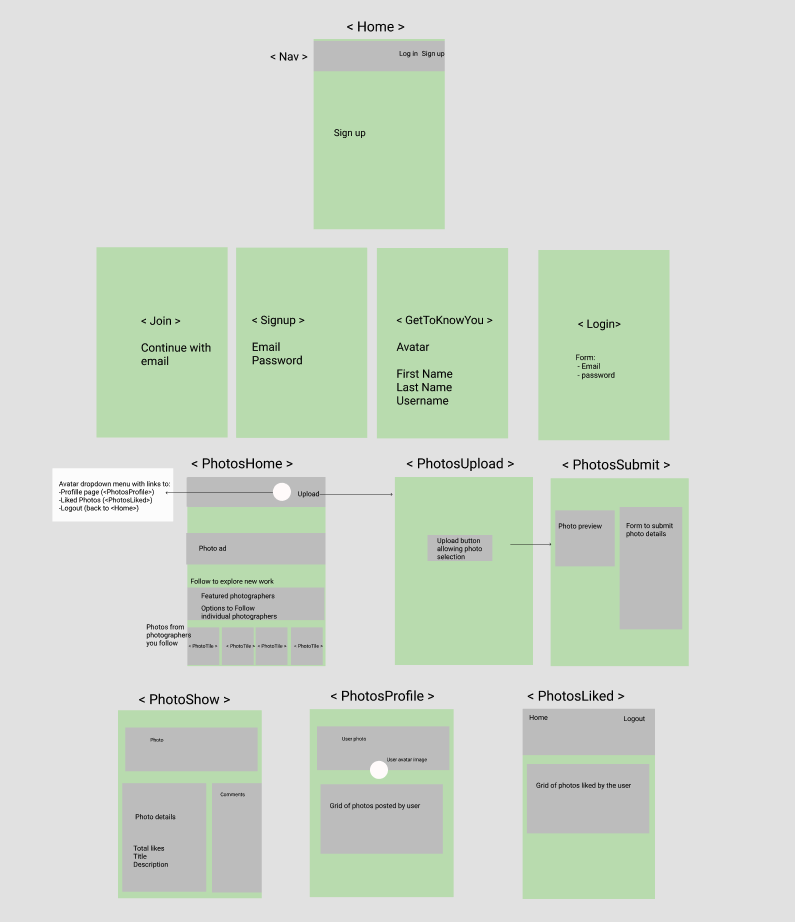
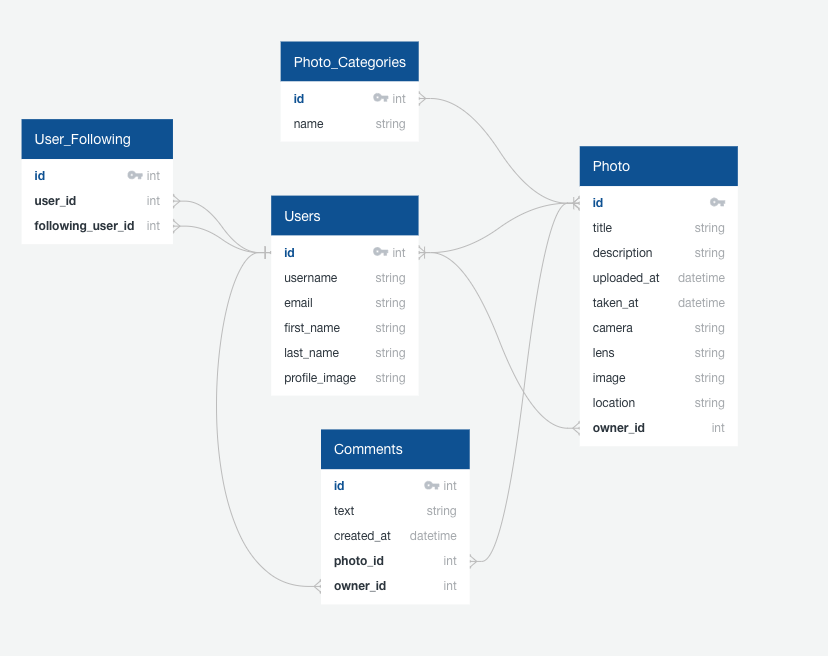

# RAWShot (aka 499px)

A full-stack app, with multiple relationships and CRUD functionality, cloning key parts of the photo-sharing website 500px

Built solo, this is my fourth and final project during the Software Engineering Immersive at General Assembly.

## Goal

Build a full-stack React app using Python, Django and PostgreSQL.

### Timescale

* 8 days

### Technologies used

* Python
* Django
* PostgreSQL
* React
* rest_framework
* Axios
* SASS
* Semantic UI React
* HTTP-proxy-middleware
* JSON Web Tokens
* PyJWT
* Git, and GitHub

### Installation

* Clone or download the repo
* Install Python packages: `pipenv`
* Load seeds data from the multiple seeds files, using `python manage.py loaddata foldername/seeds.json` and replacing `foldername` with:
  * `photo_categories`
  * `jwt_auth`
  * `photos`
  * `comments`
* Move to the frontend: `cd frontend`
* In frontend, install dependencies: `npm i`
* Back in the project root (main directory), `pipenv shell` to activate the project's virtualenv
* Start the app with `python manage.py runserver`
* Navigate in your browser to `localhost:8000/`. You should see the frontend being served to the browser.

## The App: 499px

### Live version

https://rawshot-499px.herokuapp.com/photoshome

499px (aka RAWShot) attempts to clone key features and styles of the photo-sharing website 500px (https://500px.com/). In particular with 499px users can post, comment on and like photos, as well as follow photographers.

### Wireframing and Entity Relationship Diagram

To define the key features to clone from 500px, I developed the following wireframe and entity relationship diagram (ERD)

#### ***Wireframe***:

#### ***ERD***:

