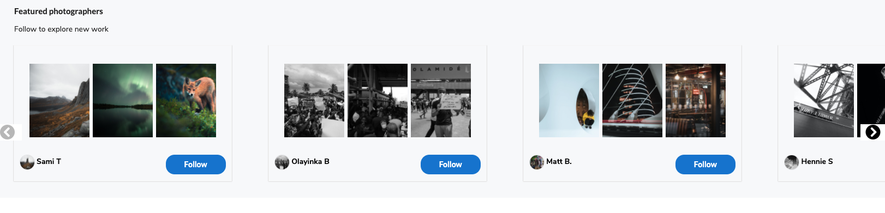

# 499px (aka RAWShot)

This app extends a previous app, which was originally built solo in 8 days as part of the Software Engineering Imersive and can be [found here](https://github.com/Simon994/RAWShot).

This project, like the original described above, is a full-stack app, with multiple relationships and CRUD functionality, cloning key parts of the photo-sharing website 500px.

The to-dos below describe new additions to the app.

## Additions (to-do / ~~done~~)

### 🔴 To do
* Migrate SCSS to individual files (possibly modules later)</li>
* Improve form validation
* Improve photo loading times
* Add OAuth

### 🟡 In Progress
* Add one-click login with blockchain using MetaMask
* Migrate to TypeScript
* Add tests

### 🟢 Done
* ~~Update documentation for readability~~

## Goal

Build a full-stack React app using Python, Django and PostgreSQL.

### Timescale

* Ongoing ([Original project](https://github.com/Simon994/RAWShot): 8 days)

### Technologies used

* Python
* Django
* PostgreSQL
* React
* rest_framework
* Axios
* SASS
* Semantic UI React
* HTTP-proxy-middleware
* JSON Web Tokens
* PyJWT
* Git, and GitHub

### Installation

* Clone or download the repo
* Install Python packages: `pipenv install --dev`
* If you don't already have it, install PostgreSQL. [Here's a good tutorial](https://flaviocopes.com/postgres-how-to-install/) covering this.
* Add a .env file in the root of the project. In it, add the following: `ENVIRONMENT=development` to ensure Django uses the correct (development) settings for the database, as per the settings.py file.
* In the project root (main directory), `pipenv shell` to activate the project's virtualenv
* Apply migrations `python manage.py migrate`
* Load seeds data from the multiple seeds files, using `python manage.py loaddata foldername/seeds.json` and replacing `foldername` with:
  * `photo_categories`
  * `jwt_auth`
  * `photos`
  * `comments`
* Move to the frontend: `cd frontend`
* In frontend, install dependencies: `npm i`
* `cd ..` to move back to the project root. Start the app with `python manage.py runserver`
* Navigate in your browser to `localhost:8000/`. You should see the frontend being served to the browser - this will be the built site. If you want to update the site and see changes to the frontend as you go, you can always start the frontend (with the backend running), by running `npm start` in the `frontend` folder.

### Testing

* Rather than using `runserver` to start the backend, from the project root, start a test server instead as follows (this will avoid polluting the default database while running tests): `python manage.py testserver frontend/cypress/fixtures/photo_categories.json frontend/cypress/fixtures/jwt_auth.json frontend/cypress/fixtures/photos.json frontend/cypress/fixtures/comments.json --noinput`
* The above command creates a test database and populates it with the data from the fixtures folder. 
* Then, from the frontend directory, start the server with `npm start`
* Finally, open the Cypress test runner with `npm run cypress-open` which should open a browser window, from where tests can be selected to be run


## The App: 499px

### Live version

https://rawshot-499px.herokuapp.com/

499px (aka RAWShot) attempts to clone key features and styles of the photo-sharing website 500px (https://500px.com/). In particular with 499px users can post, comment on and like photos, as well as follow photographers.

### Wireframe and Entity Relationship Diagram

To define the key features to clone from 500px, I developed the following wireframe and entity relationship diagram (ERD) - note that join table (and the many-to-many relationship) for followers is also shown in the ERD for clarity.

#### ***Wireframe***:


#### ***ERD***:


## Backend

### Models
As implied by the ERD, there are several models on the backend:
  * User
  * Photo
  * Photo_category
  * Comment

To build a follower system (the many-to-many relationship for followers shown in the ERD), the User model includes a `ManyToManyField`:
```javascript
class User(AbstractUser):
    email = models.CharField(max_length=50, unique=True)
    first_name = models.CharField(max_length=50)
    last_name = models.CharField(max_length=50)
    profile_image = models.CharField(max_length=400)
    followed_by = models.ManyToManyField(
        'self',
        related_name='following',
        symmetrical=False,
        blank=True
    )
```
There is also a many-to-many relationship between User and Photo that represents 'likes': a photo can be liked by many users, and many photos can be liked by a user. Another many-to-many relationship exists between Category and Photo. The Photo model is shown below.

```javascript
class Photo(models.Model):
    title = models.CharField(max_length = 75)
    description = models.TextField(max_length=300, blank=True)
    uploaded_at = models.DateTimeField(auto_now_add=True)
    taken_at = models.DateTimeField(null=True, blank=True)
    camera = models.CharField(max_length = 50, blank=True)
    lens = models.CharField(max_length = 50, blank=True)
    image = models.CharField(max_length=400)
    location = models.CharField(max_length = 75)
    categories = models.ManyToManyField(
        'photo_categories.PhotoCategory',
        related_name='photos'
    )
    owner = models.ForeignKey(
        'jwt_auth.User',
        related_name='created_photo',
        on_delete=models.CASCADE
    )
    liked_by = models.ManyToManyField(
        'jwt_auth.User',
        related_name='liked_photos',
        blank=True
    )
```

## Frontend

Throughout the frontend, I have attempted to reproduce key features of 500px, as well as matching the style and feel of that website.
As an example of similarity in styles, a side-by-side comparison of the homepages of 500px and 499px is shown below.

#### ***Reproducing the feel of 500px (left) with 499px (right)***


The Navbar is faithfully reproduced with both styling and conditional rendering; For example, conditionally rendering a link on the logo, or not, depending on whether the user is authenticated:

```JavaScript
  <div className='logo'>
    {isAuthenticated() &&
      <Link to='/photoshome' style={{ textDecoration: 'none', color: 'black' }}>
        <p>499<sup>px</sup></p>
      </Link>
    }
    {!isAuthenticated() &&
      <p>499<sup>px</sup></p>
    }
  </div>
```

The `PhotosHome` component includes a `PhotosCarousel`. To attempt to match the style and features of this carousel, I used pure-react-carousel, which allows easy control over slide width, height and the number of slides visible (which is varied depending on the screen width, using a `MediaQuery` component). The carousel also includes only profiles that the user does not already follow, via a prop on `PhotosCarousel`, `profilesSuggestedToFollow`.

```JavaScript
<CarouselProvider
  naturalSlideWidth={600}
  naturalSlideHeight={60}
  totalSlides={profilesSuggestedToFollow.length}
  visibleSlides={visibleSlides}
>
  <div className='container'>
    <Slider >
      {
        profilesSuggestedToFollow.map((profile, index) => {
          return (
            <Slide key={index} index={index} className='slide'>
              <ProfileCard
                key={profile.id}
                created_photo={profile.created_photo}
                username={profile.username}
                profileImage={profile.profile_image}
                {...profile}
              />
            </Slide>
          )
        })
      }

    </Slider>
...
```

Within the carousel, each `ProfileCard` includes selected images from photographers who you can follow, the photographer's name and a button to follow the photographer.
.

Once clicked, the `follow` `Button` is replaced, via conditional rendering, with an `unfollow` `Button`, which can be clicked if the user wants to immediately undo the preceeding follow action.

```JavaScript
{!following &&
  <Button
    className='lozenge follow'  
    floated='right'
    onClick={this.handleFollowClick}
  >Follow
  </Button>
}
{following &&
  <Button
    className='lozenge unfollow'
    floated='right'
    onClick={this.handleUnfollowClick}
  >Unfollow
  </Button>
}
```
